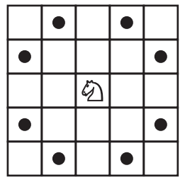

---

# Grafo do Cavalo - Tabuleiro 3x3

Este projeto implementa uma modelagem de grafo para os movimentos de uma peça de cavalo em um tabuleiro de xadrez de dimensões $3 \times 3$. O objetivo é aplicar conceitos de teoria dos grafos, como listas de adjacência, componentes conexas, caminhos mínimos e detecção de ciclos.

## Descrição do Problema

Cada casa do tabuleiro é representada por um vértice, numerado de 0 a 8 seguindo a ordem de leitura (da esquerda para a direita, de cima para baixo):
* `(0,0) -> 0`, `(0,1) -> 1`, `(0,2) -> 2`
* `(1,0) -> 3`, `(1,1) -> 4`, `(1,2) -> 5`
* `(2,0) -> 6`, `(2,1) -> 7`, `(2,2) -> 8`

Uma aresta existe entre dois vértices se um cavalo puder se mover de uma casa para a outra em um único movimento (formato em "L").



## Estrutura do Projeto
```text
grafo-do-cavalo/
├── README.md
├── img/README
|   └── 1774623060984.png
├── dados/
│   └── entrada.txt
└── src/
    ├── main.ipynb
    ├── graph.py 
    ├── cc.py
    ├── cycle.py
    ├── bag.py
    ├── depth_first_paths.py
    └── breadth_first_paths.py
```
O projeto está organizado da seguinte forma:
* `dados/entrada.txt`: Arquivo contendo o número de vértices, arestas e a lista de conexões no formato `algs4`.
* `src/graph.py`: Implementação da estrutura do grafo utilizando lista de adjacência.
* `src/cc.py`: Algoritmo para identificação de componentes conexas via DFS.
* `src/breadth_first_paths.py`: Algoritmo BFS para cálculo de distância mínima.
* `src/cycle.py`: Algoritmo para detecção e recuperação de ciclos.
* `src/main.ipynb` ou `main.py`: Ponto de entrada que executa as análises e exibe os resultados.

## Perguntas e Respostas do Programa

### 1. Qual é o grafo do cavalo informado, na forma de lista de adjacência?
A lista de adjacência gerada a partir dos movimentos válidos é:
* **0**: 7, 5
* **1**: 8, 6
* **2**: 7, 3
* **3**: 8, 2
* **4**: (Vértice isolado)
* **5**: 6, 0
* **6**: 5, 1
* **7**: 2, 0
* **8**: 3, 1

### 2. Quais são as componentes conexas do grafo?
O grafo possui **2 componentes conexas**:
* **Componente 0**: Contém os vértices `{0, 1, 2, 3, 5, 6, 7, 8}`.
* **Componente 1**: Contém apenas o vértice `{4}` (o centro do tabuleiro, que é inacessível para o cavalo apartir de outros vértices em um tabuleiro $3 \times 3$).

### 3. Qual é a distância mínima entre as posições (0,0) e (2,2)?
A posição `(0,0)` corresponde ao vértice **0** e `(2,2)` ao vértice **8**.
* **Caminho encontrado**: `0 -> 5 -> 6 -> 1 -> 8`.
* **Distância mínima**: **4 movimentos**.

### 4. O grafo possui ciclo? (Análise de Complexidade)
**Sim**, o grafo possui ciclo.

**Análise de Complexidade do Algoritmo de Detecção de Ciclo (DFS):**
* **Tempo**: $O(V + E)$, onde $V$ é o número de vértices e $E$ o número de arestas. O algoritmo visita cada vértice e cada aresta no máximo uma vez durante a busca em profundidade.
* **Espaço**: $O(V)$, necessário para manter os arrays auxiliares de marcação (`visited`) e a pilha de recursão para reconstruir o caminho. A lista de adjacência em si ocupa $O(V + E)$.

### 5. Se o grafo possuir ciclo, quais são os vértices de um ciclo encontrado?
Um ciclo identificado no grafo é:
* **Ciclo**: `0 -> 7 -> 2 -> 3 -> 8 -> 1 -> 6 -> 5 -> 0`.

## Como Executar

Para rodar o projeto e ver os resultados:

1.  Certifique-se de ter o Python instalado.
2.  Navegue até a pasta `src/`.
3.  Abra o notebook (`main.ipynb`) e execute todas as célula para visualizar a saída formatada.